## Roman Numeral Converter API

Spring Boot 3 REST service that converts integers **1–3999** to Roman numerals, with API-key security, validation, async range conversion, Micrometer metrics, optional New Relic export, and OpenAPI (Swagger UI).

**Scope clarification:** This project focuses on the core Roman numeral conversion API requirements.
The additional pieces (API key auth, metrics/observability, Docker, and optional New Relic integration) are production-oriented enhancements to show how the service could be run and reviewed in a real environment.

---

### Table of contents

- [What’s implemented](#whats-implemented)
- [Architecture](#architecture)
- [Project structure](#project-structure)
- [Local setup (Docker)](#local-setup-docker)
- [Format, tests, and coverage (Maven)](#format-tests-and-coverage-maven)
- [API reference](#api-reference)
- [OpenAPI / Swagger](#openapi--swagger)
- [Monitoring and metrics](#monitoring-and-metrics)
- [Validation and errors](#validation-and-errors)
- [Future enhancements](#future-enhancements)

---

### What’s implemented

| Area | Details |
|------|---------|
| **REST API** | `GET /romannumeral` — single integer (`query`) or inclusive range (`min` & `max`) |
| **Domain** | Pure converter `1…3999` → Roman string; range results **sorted ascending** |
| **Concurrency** | Range uses `CompletableFuture` + thread pool `Executor`; pool size from `RANGE_EXECUTOR_THREADS` or CPU-based default |
| **Security** | Stateless API key filter (`API_KEY_HEADER` / `APP_API_KEY`); role `API` for protected routes |
| **Validation** | Shared `RomanRequestValidator`; invalid inputs return **400** with JSON `{ "error": "…" }` |
| **Observability** | Structured logs include `requestId` (taken from `x-request-id` if provided, otherwise generated); **Micrometer** custom meters + JVM/process/system |
| **Metrics** | Servlet filter (`RomanMetricsFilter`) records `roman.request.latency` and increments `roman.single.requests`, `roman.range.requests`, and `roman.invalid.requests` (**400 responses** for `/romannumeral`) |
| **Actuator** | `/actuator/health` (public), `/actuator/metrics` (protected, same API key) |
| **New Relic (optional)** | Micrometer **OTLP** to New Relic (`NEW_RELIC_METRICS_EXPORT`); **Java agent** mounted via Compose (`./newrelic` → `/opt/newrelic`) for APM/logs |
| **Docs** | **springdoc-openapi** — Swagger UI + OpenAPI 3 JSON |
| **Quality** | **Spotless** (Google Java Format), **JaCoCo** (unit + integration reports), JUnit 5 |

---

### Architecture

High-level request flow:

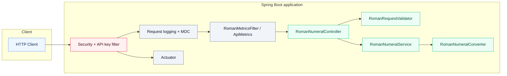

Range conversion uses an **executor-backed** async path; Micrometer counters + request latency are recorded in a servlet filter around `/romannumeral`.

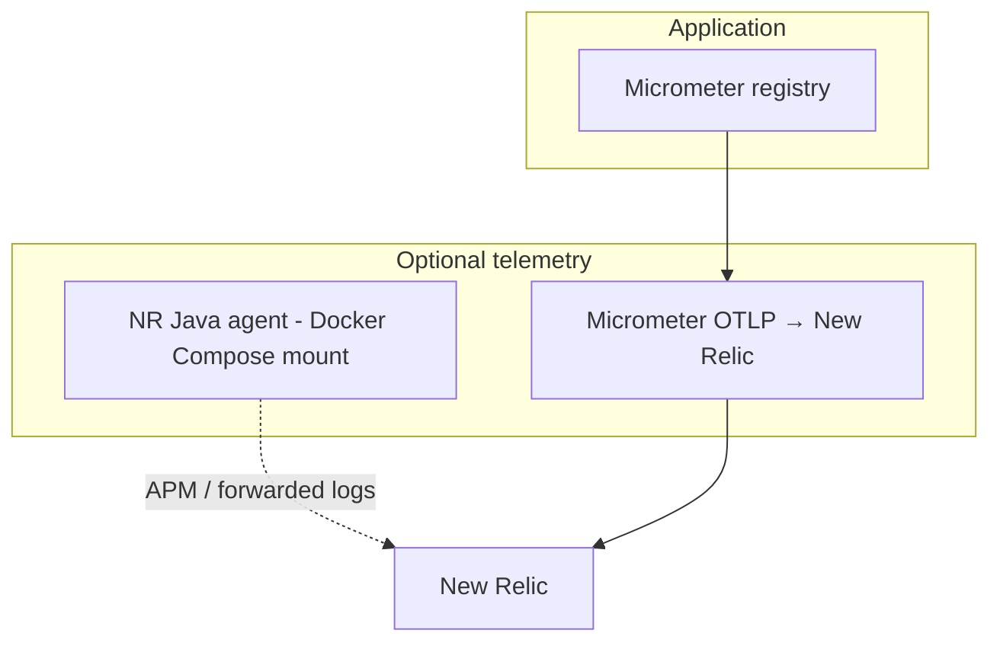

---

### Project structure

```text
.
├── Dockerfile
├── docker-compose.yml
├── pom.xml
├── README.md
├── .env.example
├── scripts/
│   └── download-newrelic-agent.sh
├── docs/      
└── src/
    ├── main/
    │   ├── java/com/example/romanapi/...
    │   └── resources/
    │       ├── application.yml
    │       └── logback-spring.xml
    └── test/
        └── java/com/example/romanapi/...
```

---

### Local setup (Docker)

**Prerequisites:**

- Docker Desktop (or Engine) with Compose v2
- Java 17 + Maven (recommended for running `mvn spotless:check`, `mvn test`, `mvn verify` locally)

1. **Environment**

   ```bash
   cp .env.example .env
   ```

   Edit `.env` and set at least:

   - `APP_API_KEY` — secret the API must receive (e.g. `my-test-key`)
   - `API_KEY_HEADER` — defaults to `x-api-key`

   Optional: `APP_NAME`, `PORT`, `RANGE_EXECUTOR_THREADS`, New Relic keys (see `.env.example`).

2. **New Relic Java agent (optional)**

   For APM + log forwarding with Compose, install the agent once on the host:

   ```bash
   chmod +x scripts/download-newrelic-agent.sh
   ./scripts/download-newrelic-agent.sh
   ```

   This creates `./newrelic/newrelic.jar` (ignored by git). If the directory is missing, Compose still starts the app **without** the agent and prints a hint.

3. **Run the API**

   ```bash
   docker compose up -d --build
   ```

   The service listens on `PORT` from `.env` (default **8080**). Map matches `server.port` in `application.yml`.

   <details>
   <summary>Docker container screenshot</summary>

   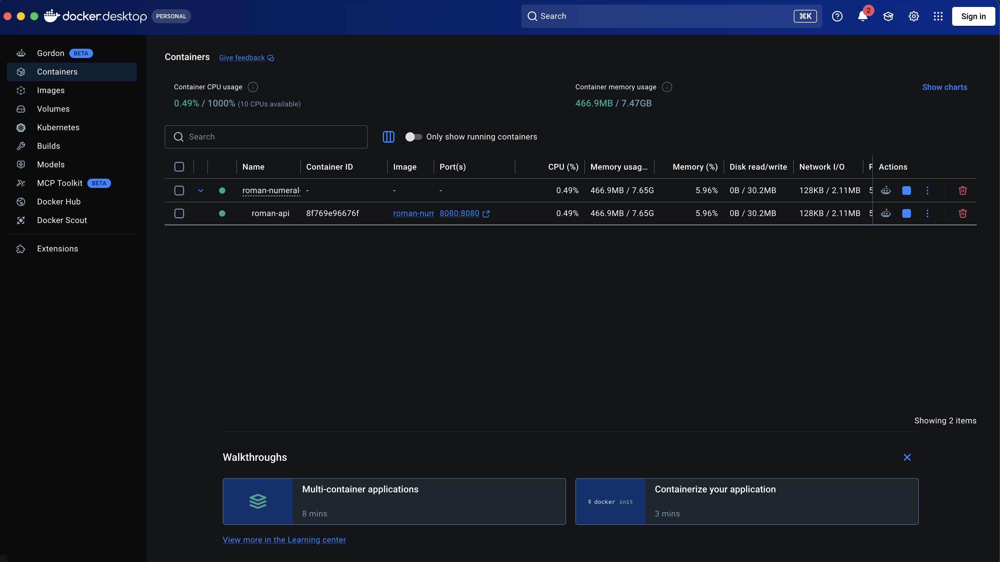

   </details>

   <details>
   <summary>Docker logs screenshot</summary>

   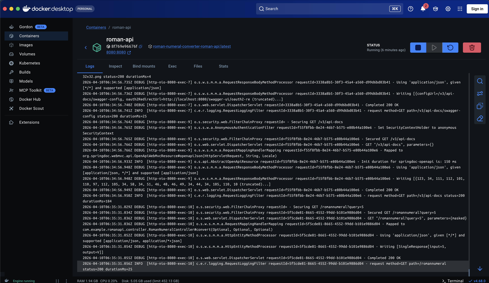

   </details>

4. **Stop**

   ```bash
   docker compose down
   ```

---

### Format, tests, and coverage (Maven)

Use **JDK 17** and Maven on the host (not via Compose).

From the repository root:

| Goal | Command |
|------|---------|
| Format check | `mvn spotless:check` |
| Auto-format | `mvn spotless:apply` |
| Unit tests | `mvn test` |
| Full verify (unit + IT + JaCoCo) | `mvn verify` |

Tests cover:
- **Valid inputs** (single and range)
- **Edge cases** (e.g. 1, 4, 9, 40, 90, 400, 900, 3999)
- **Invalid inputs** (missing params, mixed mode, out-of-range values) and consistent JSON error responses

After `mvn verify`, open:

- Unit coverage: `target/site/jacoco-ut/index.html`
- Integration coverage: `target/site/jacoco-it/index.html`

<details>
<summary>Unit test coverage screenshot</summary>

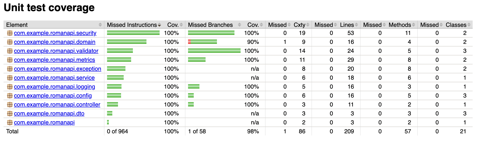

</details>

<details>
<summary>Integration test coverage screenshot</summary>

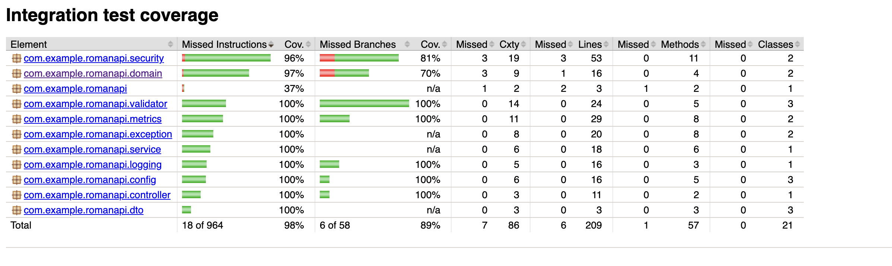

</details>

---

### API reference

Base URL: `http://localhost:8080` (or your `PORT`).

All protected calls must send the API key using the configured header (default **`x-api-key`**).

#### Health (no API key)

| Method | Path | Description |
|--------|------|-------------|
| `GET` | `/actuator/health` | Liveness/readiness JSON |

#### Roman numeral conversion (API key required)

| Method | Path | Query | Success |
|--------|------|-------|---------|
| `GET` | `/romannumeral` | `query=<int>` | **200** JSON single conversion |
| `GET` | `/romannumeral` | `min=<int>&max=<int>` | **200** JSON list of conversions (sorted) |

**Single response** (`200`):

```json
{
  "input": "9",
  "output": "IX"
}
```

**Range response** (`200`):

```json
{
  "conversions": [
    { "input": "1", "output": "I" },
    { "input": "2", "output": "II" }
  ]
}
```

**Examples**

```bash
# Health
curl -sS http://localhost:8080/actuator/health

# Single (replace key with your APP_API_KEY)
curl -sS -H "x-api-key: my-test-key" "http://localhost:8080/romannumeral?query=9"

# Range
curl -sS -H "x-api-key: my-test-key" "http://localhost:8080/romannumeral?min=1&max=3"

# Metrics (protected)
curl -sS -H "x-api-key: my-test-key" "http://localhost:8080/actuator/metrics"
```

<details>
<summary>Single conversion API screenshot</summary>

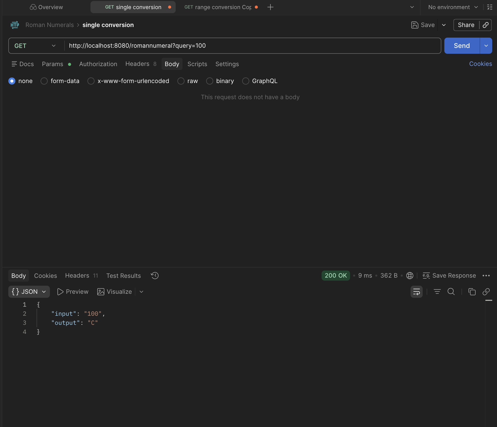

</details>

<details>
<summary>Range conversion API (Postman) screenshot</summary>

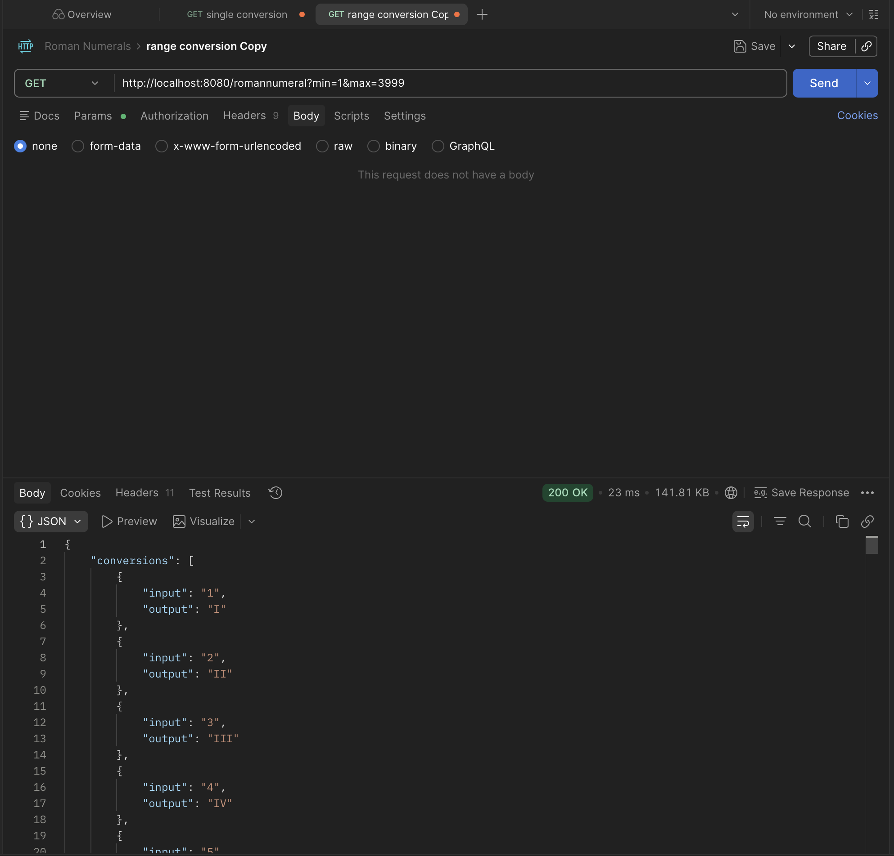

</details>

**Common status codes**

| Code | Meaning |
|------|---------|
| **200** | OK |
| **400** | Validation error — body `{ "error": "…" }` |
| **401** | Missing/invalid API key |

---

### OpenAPI / Swagger

Interactive docs are **unauthenticated** (see `SecurityConfig`).

| Resource | URL |
|----------|-----|
| **Swagger UI** | http://localhost:8080/swagger-ui.html |
| **OpenAPI JSON** | http://localhost:8080/v3/api-docs |

Use **Authorize** in Swagger UI if operations are documented with the API key security scheme (header name from `API_KEY_HEADER`).

<details>
<summary>Swagger UI screenshot</summary>

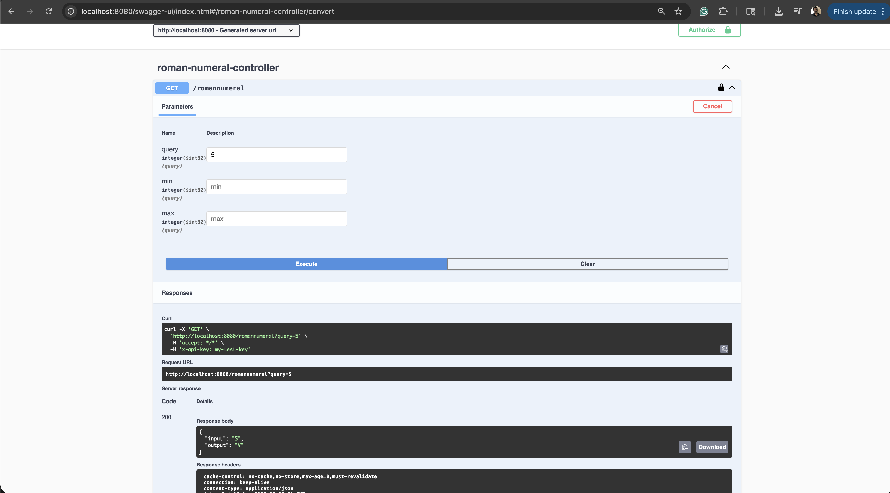

</details>

---

### Monitoring and metrics

| Feature | Where |
|---------|--------|
| **Spring Boot Actuator** | `/actuator/health`, `/actuator/metrics` (metrics endpoint requires API key) |
| **Micrometer** | JVM, process, system meters; custom `roman.*` counters/timer |
| **Request correlation** | Optional header `x-request-id`; if absent/blank a UUID is generated. The value is logged as MDC `requestId` for log correlation. |
| **New Relic OTLP** | Set `NEW_RELIC_METRICS_EXPORT=true` and `NEW_RELIC_LICENSE_KEY` in `.env`; US endpoint default in `application.yml` |
| **New Relic Java agent (implemented)** | Compose mounts `./newrelic`; JVM flags set in `docker-compose.yml` for app name + log forwarding. Set `NEW_RELIC_LICENSE_KEY`, `NEW_RELIC_APP_NAME` (or rely on `APP_NAME`). Use `DISABLE_NEW_RELIC_AGENT=true` to skip the agent. |

<details>
<summary>New Relic APM summary screenshot</summary>

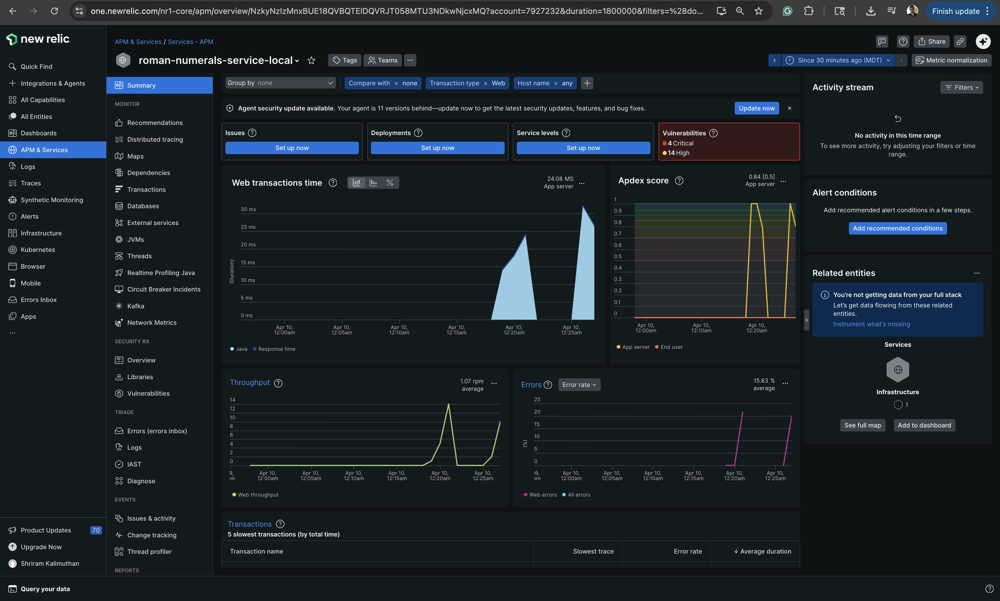

</details>

<details>
<summary>New Relic dashboard screenshot</summary>

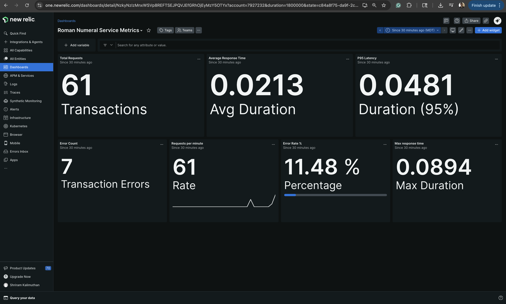

</details>

<details>
<summary>New Relic logs screenshot</summary>

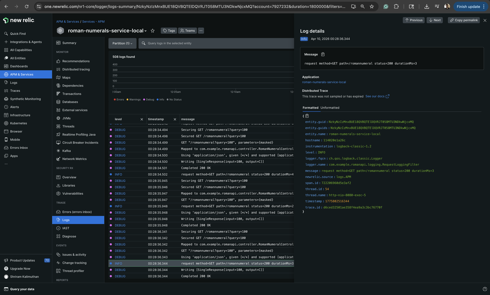

</details>

<details>
<summary>JVM metrics screenshot</summary>

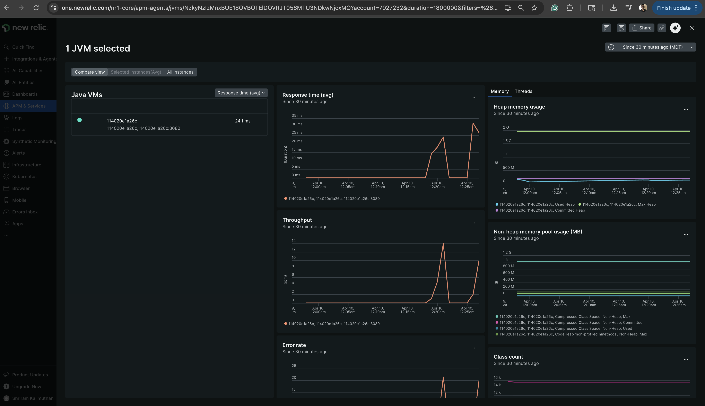

</details>

---

### Validation and errors

- Choose **one mode**:
  - **Single**: provide `query=<int>`
  - **Range**: provide both `min=<int>&max=<int>` (inclusive)
- Do **not** mix modes (e.g. `query` with `min/max`).
- Integers must be in **1–3999**; for range, require **`min < max`** (a minimum of 2 values per range request).
- On failure, the API returns **400** with JSON: `{ "error": "<message>" }`.

<details>
<summary>Validation error example screenshot</summary>

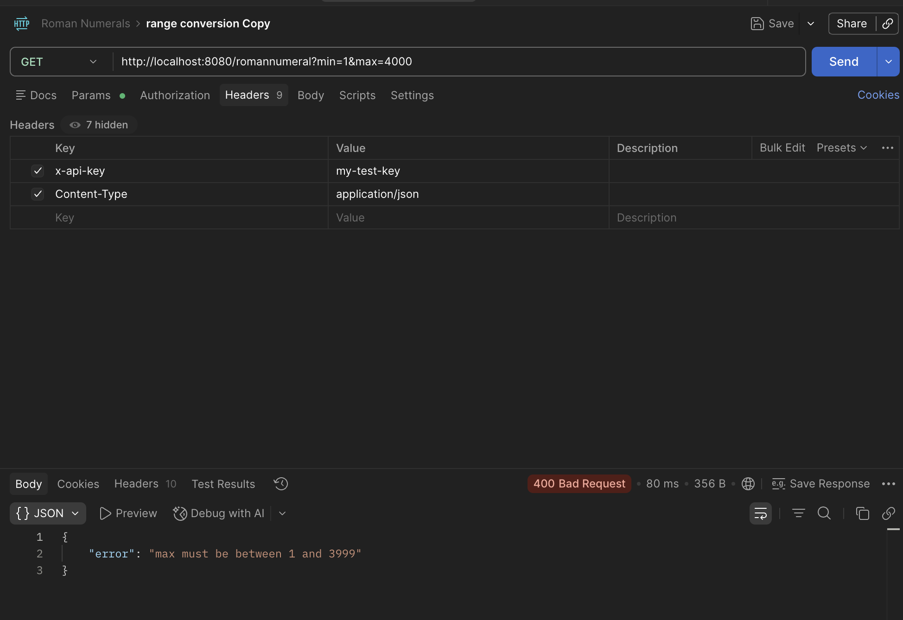

</details>

---

### Future enhancements

The current implementation focuses on correctness, testability, and observability. The architecture is intentionally extensible for production-grade systems. Potential enhancements include:

#### 1. Security and authentication

Authentication is **API key**–based today. If requirements change, alternatives could include OAuth2/OIDC, JWT (e.g. resource server), AWS Cognito, or M2M client credentials.

If you **keep API keys**, prefer handling **issuance, rotation, and revocation** in a dedicated place—such as an **API gateway**, a small **auth service**, or **AWS Secrets Manager** / similar—rather than embedding long-lived keys only in application config. That gives teams a clear process for key lifecycle and limits blast radius when a key leaks.

#### 2. Observability and monitoring

- Build on existing New Relic integration: **Micrometer OTLP metrics** (when enabled), plus **APM, traces, and log forwarding** from the New Relic Java agent in Docker—so request-level visibility and correlation are already in place when the agent is used
- Optional hardening: unify export paths (e.g. one collector or OTLP strategy) if you adopt a broader OpenTelemetry standard across services
- Define alerts and dashboards for error rates, latency, and throughput
- Create New Relic alerts (e.g. high error rate, high latency, elevated 5xx, JVM memory pressure)

#### 3. Performance and load testing

- Introduce load and stress testing using tools such as JMeter or k6
- Measure system behavior under concurrent range requests
- Characterize **latency** (response time) and **throughput** (requests per second) under load—for example comparing small single-`query` calls vs large `min`/`max` ranges—to find limits and tune the range executor
- Identify bottlenecks and optimize thread pool configuration
- Add rate limiting to protect against excessive load (often implemented at an **API gateway** or edge layer rather than in the app alone)

#### 4. Deployment and infrastructure

The service is **already containerized** (multi-stage `Dockerfile`, `docker compose` for local runs). Potential next steps:

- Publish images to a registry (e.g. Amazon ECR, GHCR) with immutable version tags and vulnerability scanning
- Deploy to AWS (ECS/Fargate, EKS, or EC2) with health checks, autoscaling, and rolling updates
- Manage infrastructure as code (e.g. Terraform, CloudFormation)
- Store secrets in AWS Secrets Manager or Parameter Store in production

#### 5. Scalability and performance optimization

- **Range parallelization:** today each integer in `min`…`max` is converted on a **fixed thread pool** (`CompletableFuture` per value, capped by `RANGE_EXECUTOR_THREADS` or a default). Under load or for very wide ranges, you might revisit **how work is split** (e.g. fewer, larger chunks instead of one task per number), **pool sizing**, or **limits** on range size so one request cannot schedule an extreme number of concurrent tasks—guided by profiling and load tests
- Add horizontal scaling behind a load balancer when load tests and latency or SLO targets show the single instance is insufficient

#### 6. API and feature enhancements

- Introduce API versioning strategy
- Introduce pagination for future endpoints that may return larger datasets

#### 7. Code quality and CI/CD

- Add CI pipelines (e.g. GitHub Actions) that run `mvn verify`, Spotless, and Docker image builds on every PR
- Integrate static analysis tools such as SonarQube
- Gate merges on quality checks and keep Spotless/Java style enforcement in CI
- Require **two approvers** on pull requests before merge (in addition to passing CI)

